# 标题
> # 一级标题
> ## 二级标题
> ### 三级标题
# 换行
这是一段普通的文本，  
直接回车不能换行，<br>  
要使用\<br>  
# 引用
## 一般引用
> 第一级引用
>> 第二级引用
>>> 第三级引用
## 多行引用(gitlab支持)
>>>
这是

一个

多行

引用
>>>

# 列表
## 无序列表
- 无序列表项1
+ 无序列表项2
* 无序列表项3
## 有序列表
1. 有序列表项1
2. 有序列表项2
3. 有序列表项3
## 列表下用引用要缩进
- 列表下的引用
  > 列表下的引用缩进两个空格
## 代办列表
- [ ] 不勾选
- [x] 勾选

# 代码
```ruby
require 'redcarpet'
markdown = Redcarpet.new("Hello World!")
puts markdown.to_html
```
```cpp
class AC_P {
public:

    /// Constructor for P that saves its settings to EEPROM
    ///
    /// @note	PIs must be named to avoid either multiple parameters with the
    ///			same name, or an overly complex constructor.
    ///
    /// @param  initial_p       Initial value for the P term.
    ///
    AC_P(const float &initial_p = 0.0f)
    {
		AP_Param::setup_object_defaults(this, var_info);
        _kp = initial_p;
    }

    /// Iterate the P controller, return the new control value
    ///
    /// Positive error produces positive output.
    ///
    /// @param error	The measured error value
    /// @param dt		The time delta in milliseconds (note
    ///					that update interval cannot be more
    ///					than 65.535 seconds due to limited range
    ///					of the data type).
    ///
    /// @returns		The updated control output.
    ///
    float       get_p(float error) const;

    /// Load gain properties
    ///
    void        load_gains();

    /// Save gain properties
    ///
    void        save_gains();

    /// @name	parameter accessors
    //@{

    /// Overload the function call operator to permit relatively easy initialisation
    void operator() (const float p) { _kp = p; }

    // accessors
    AP_Float    &kP() { return _kp; }
    const AP_Float &kP() const { return _kp; }
    void        kP(const float v) { _kp.set(v); }

    static const struct AP_Param::GroupInfo        var_info[];

private:
    AP_Float        _kp;
};
```
语言名 | 关键字
----- | -----
Bash | bash
CoffeeScript | coffeescript
C++ | cpp
C# | cs
CSS | css
Diff | diff 
HTTP | http 
Ini | ini 
Java | java 
JavaScript | javascript 
JSON | json 
Makefile | makefile 
Markdown | markdown 
Objective-C | objectivec 
Perl | perl 
Python | python 
Ruby | ruby 
SQL | sql 
XML | xml 
ARM汇编 | armasm 
AVR汇编 | avrasm 
MIPS汇编 | mipsasm 
x86汇编 | x86asm 
Elixir | elixir 
Elm | elm 
Erlang | erlang 
F# | fsharp 
Haskell | haskell 
GLSL | glsl 
Clojure | clojure 
Lisp | lisp 

# 强调
## *斜体*
> *文字倾斜*
> _文字倾斜_
## **粗体**
> **文字加粗**
> __文字加粗__
## ***斜体加粗***
> ***斜体加粗***
## ~~删除线~~
> ~~删除的文字~~
在页面下方生成脚注 1.[^1]
# 表格
## 普通表格
First Header | Second Header | Third Header
------------ | ------------- | ------------
Content Cell | Content Cell  | Content Cell
Content Cell | Content Cell  | Content Cell
## 设置文字对正的表格
First Header | Second Header | Third Header
:----------- | :-----------: | -----------:
Left         | Center        | Right
Left         | Center        | Right

# 分割线

三个或者三个以上的 - 或者 * 都可以，显示效果有差别。

-分割线上
---
-分割线下

*分割线上
***
*分割线下

# 图形
- TB 从上到下
- BT 从下到上
- RL 从右到左
- LR 从左到右
- TD 同TB
## 流程图

## 节点形状
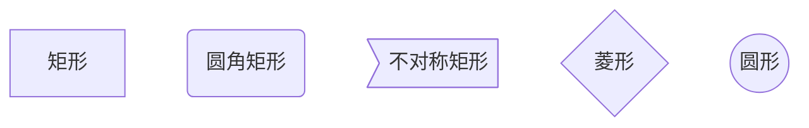
## 连线
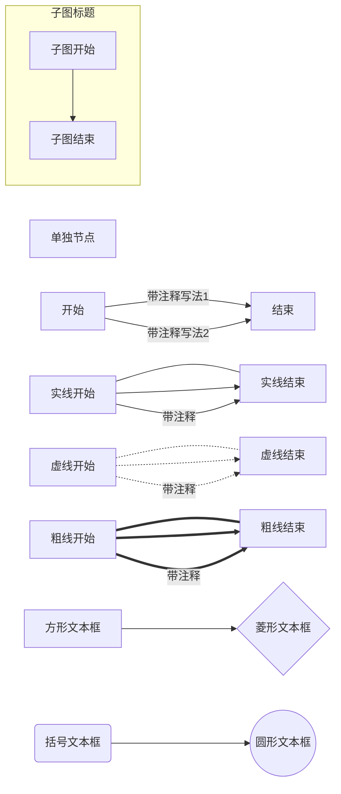
## 子流程
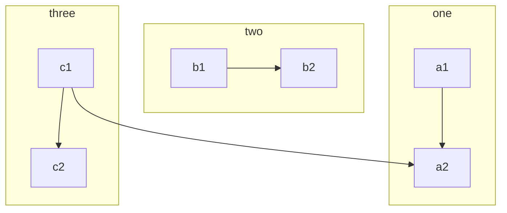
## 自定义样式
### 样式1
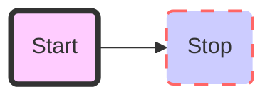
### 样式2
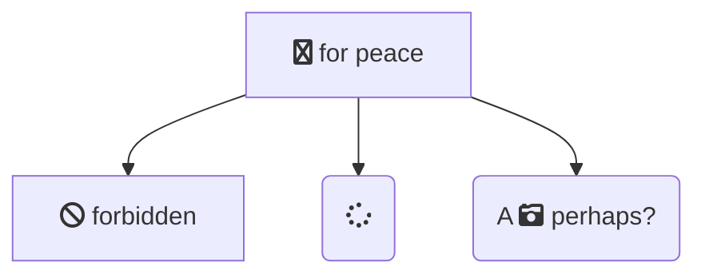
### 样式3

## [时序图](http://blog.lisp4fun.com/2017/11/21/mermaiduse)
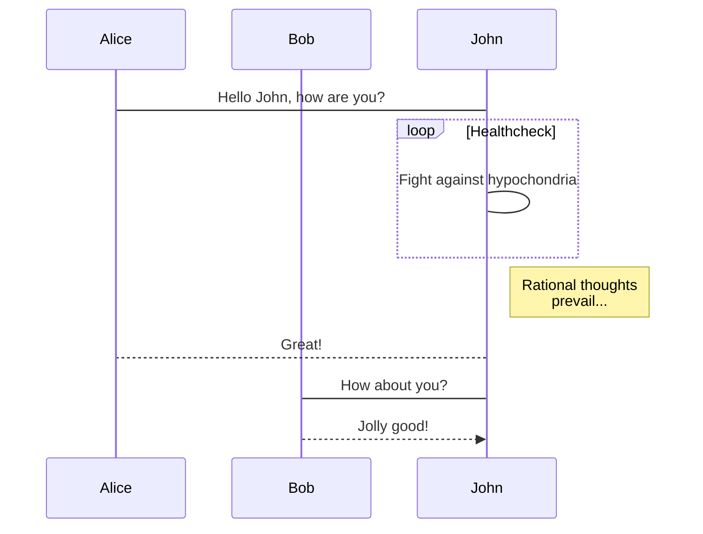
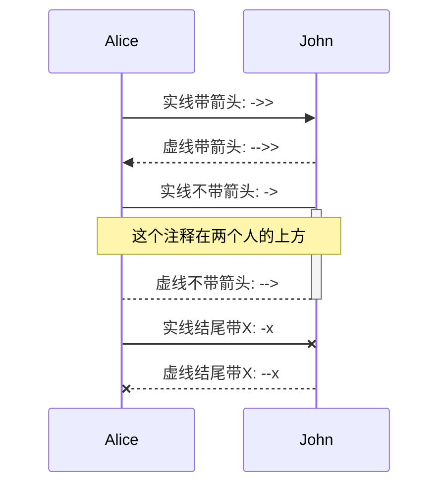
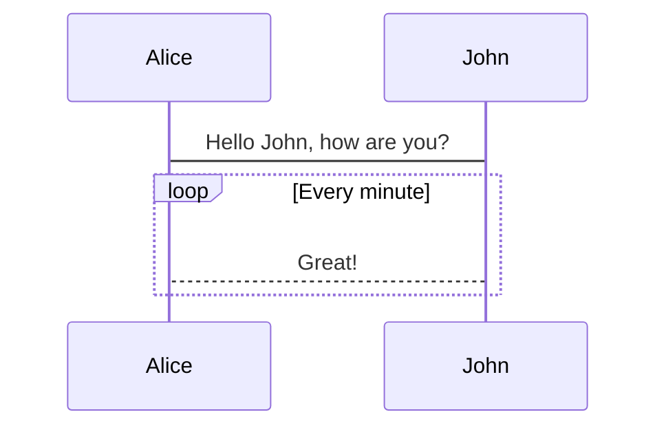
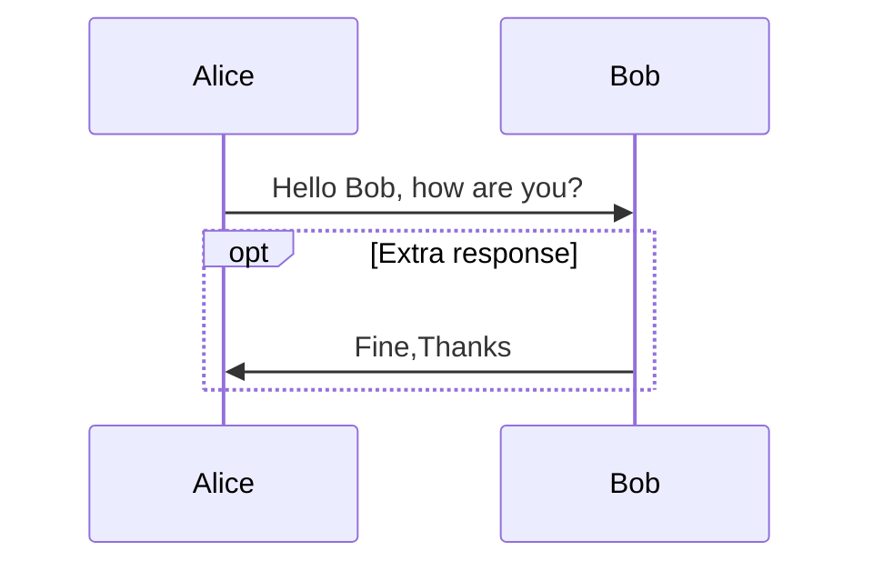
## [甘特图](https://www.iminho.me/wiki/docs/mindoc/mermaid.md)
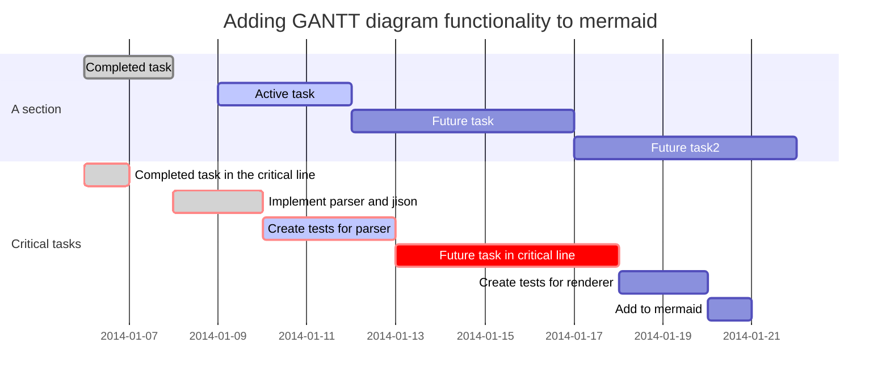
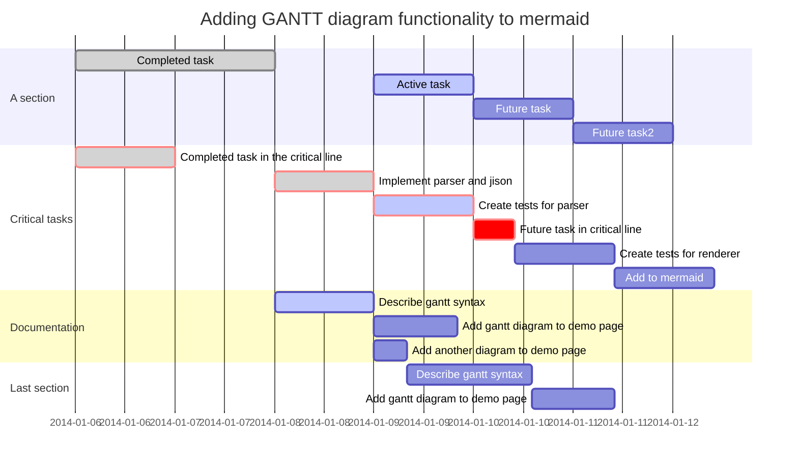
# Gitlab
## 文字低色
- {+ additions +}
- [+ additions +]
- {- deletions -}
- [- deletions -]
- `给文字加底色`

## 公式
This math is inline $`a^2+b^2=c^2`$.

This is on a separate line
```math
a^2+b^2=c^2
```

## 颜色
`#F00`
`#F00A`
`#FF0000`
`#FF0000AA`
`RGB(0,255,0)`
`RGB(0%,100%,0%)`
`RGBA(0,255,0,0.7)`
`HSL(540,70%,50%)`
`HSLA(540,70%,50%,0.7)`
-   文字前加颜色标记
-  `注意https链接写法` 
-  `#1589F0` 

## 脚注
在页面下方生成脚注 2.[^2]
[^1]: 脚注 1.
[^2]: 脚注 2.

## 上/下角标
The formula for water is H<sub>2</sub>O
while the equation for the theory of relativity is E = mc<sup>2</sup>.

